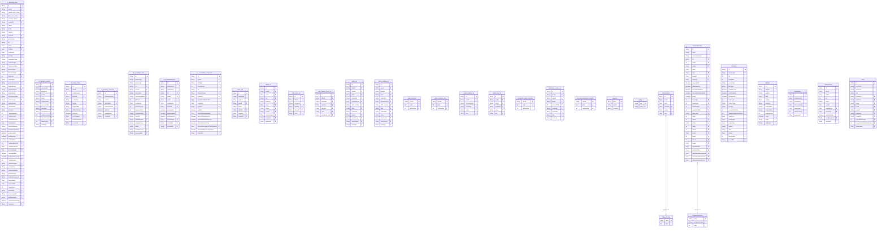

```mermaid
erDiagram

  "ai_telemetry_logs" {
    String id "🗝️"
    String userId "❓"
    String original_auto_config "❓"
    String final_user_config "❓"
    String override_reason "❓"
    String createdAt "❓"
    String offerId "❓"
    String wellId "❓"
    String clientId "❓"
    String projectId "❓"
    String warehouse "❓"
    String dn "❓"
    Float rzDna "❓"
    Float rzWlazu "❓"
    Float wellHeight "❓"
    String wellType "❓"
    String terminationType "❓"
    String reductionType "❓"
    String zwiencenieType "❓"
    String dennicaType "❓"
    Float dennicaHeight "❓"
    Int ringCount "❓"
    String ringHeights "❓"
    String appliedReductions "❓"
    String appliedKonus "❓"
    String appliedHatches "❓"
    String appliedSeals "❓"
    String allComponentIds "❓"
    String solverSource "❓"
    String solverVersion "❓"
    String rulesVersion "❓"
    String aiVersion "❓"
    Int computationMs "❓"
    Int iterationCount "❓"
    Int checkedVariants "❓"
    Float rankingScore "❓"
    String selectionReason "❓"
    Boolean wasAutoGenerated
    Boolean wasAccepted
    Boolean wasRejected
    Boolean wasModified
    Int modificationCount "❓"
    Float confidenceScore "❓"
    Float learningWeight "❓"
    Boolean trainingEligible
    Boolean feedbackProcessed
    Int configVersion "❓"
    String parentConfigId "❓"
    String reviewStatus "❓"
    String featureSnapshot "❓"
    String labelSnapshot "❓"
    String predictionSnapshot "❓"
    Float rewardValue "❓"
    Float successRate "❓"
    Int usageCount "❓"
    String lastUsedAt "❓"
    String lastAcceptedAt "❓"
    String lastRejectedAt "❓"
    Boolean manualOverrideFlag
    String extraMeta "❓"
    }


  "ai_telemetry_events" {
    String id "🗝️"
    String telemetryId "❓"
    String eventType
    String userId "❓"
    String wellId "❓"
    String componentId "❓"
    String previousValue "❓"
    String newValue "❓"
    String changeReason "❓"
    Int msSinceConfig "❓"
    Int orderInSession "❓"
    Int sequenceNo "❓"
    String createdAt "❓"
    }


  "ai_config_history" {
    String id "🗝️"
    String wellId "❓"
    Int configVersion
    String parentId "❓"
    String configJson "❓"
    String source "❓"
    String triggeredBy "❓"
    String diffFromParent "❓"
    Boolean isCurrent
    Float rankingScore "❓"
    String selectionReason "❓"
    String createdAt "❓"
    }


  "ai_telemetry_versions" {
    String id "🗝️"
    String componentType
    String version
    String description "❓"
    String schemaVersion "❓"
    Boolean isActive
    String appliedFrom "❓"
    String createdAt "❓"
    }


  "ai_knowledge_base" {
    String id "🗝️"
    String patternType
    String patternKey
    String dn "❓"
    String context "❓"
    String description "❓"
    String recommendation "❓"
    Int hitCount
    Float confidence
    Int successCount
    Int rejectionCount
    String firstDetectedAt "❓"
    String lastHitAt "❓"
    String lastUpdatedAt "❓"
    String changeHistory "❓"
    String status
    String schemaVersion "❓"
    String generatedBy "❓"
    }


  "ai_recommendations" {
    String id "🗝️"
    String patternType
    String patternKey
    String dn "❓"
    String wellId "❓"
    Float score
    Float confidence
    String payload "❓"
    Boolean wasApplied
    Boolean wasAccepted
    Boolean wasRejected
    String generatedAt "❓"
    String decidedAt "❓"
    String decidedBy "❓"
    }


  "ai_transition_snapshots" {
    String id "🗝️"
    String wellId "❓"
    String configId "❓"
    Int transitionNo "❓"
    String dn "❓"
    String transitionType "❓"
    String producer "❓"
    Float heightFromBottomMm "❓"
    Float angleDeg "❓"
    String position "❓"
    Boolean collided
    Float affectedDennicaHeight "❓"
    Boolean affectedRingSelection
    Boolean affectedReductionChoice
    Boolean affectedFinalConfig
    Float minimalDennicaForTransitionsMm "❓"
    Boolean solverModifiedForTransitions
    String createdAt "❓"
    }


  "audit_logs" {
    String id "🗝️"
    String entityType
    String entityId
    String userId "❓"
    String action
    String oldData "❓"
    String newData "❓"
    String createdAt "❓"
    }


  "clients_rel" {
    String id "🗝️"
    String userId "❓"
    String name "❓"
    String nip "❓"
    String address "❓"
    String email "❓"
    String phone "❓"
    String contact "❓"
    String clientNumber "❓"
    String createdAt "❓"
    String updatedAt "❓"
    }


  "offer_items_rel" {
    String id "🗝️"
    String offerId "❓"
    String productId "❓"
    Float quantity "❓"
    Float discount "❓"
    Float price "❓"
    }


  "offer_studnie_items_rel" {
    String id "🗝️"
    String offerId "❓"
    String productId "❓"
    Float quantity "❓"
    Float discount "❓"
    Float price "❓"
    String dodatkowe_info "❓"
    }


  "offers_rel" {
    String id "🗝️"
    String userId "❓"
    String clientId "❓"
    String state "❓"
    String createdAt "❓"
    Float transportCost "❓"
    String offer_number "❓"
    String data "❓"
    String updatedAt "❓"
    String history "❓"
    String clientName "❓"
    String investName "❓"
    String clientNip "❓"
    }


  "offers_studnie_rel" {
    String id "🗝️"
    String userId "❓"
    String clientId "❓"
    String state "❓"
    String createdAt "❓"
    Float transportCost "❓"
    String offer_number "❓"
    String data "❓"
    String updatedAt "❓"
    String history "❓"
    String clientName "❓"
    String investName "❓"
    String clientNip "❓"
    }


  "order_counters" {
    String userId "🗝️"
    Int year "🗝️"
    Int lastNumber "❓"
    }


  "order_counters_rury" {
    String userId "🗝️"
    Int year "🗝️"
    Int lastNumber "❓"
    }


  "orders_studnie_rel" {
    String id "🗝️"
    String userId "❓"
    String offerStudnieId "❓"
    String createdAt "❓"
    String status "❓"
    String data "❓"
    }


  "orders_rury_rel" {
    String id "🗝️"
    String userId "❓"
    String offerId "❓"
    String createdAt "❓"
    String status "❓"
    String data "❓"
    }


  "production_order_counters" {
    String userId "🗝️"
    Int year "🗝️"
    Int lastNumber "❓"
    }


  "production_orders_rel" {
    String id "🗝️"
    String userId "❓"
    String orderId "❓"
    String wellId "❓"
    Int elementIndex "❓"
    String createdAt "❓"
    String updatedAt "❓"
    String data "❓"
    String creatorId "❓"
    }


  "recycled_production_numbers" {
    String userId "🗝️"
    Int year "🗝️"
    Int seqNumber "🗝️"
    }


  "sessions" {
    String token "🗝️"
    String userId
    BigInt createdAt
    }


  "settings" {
    String key "🗝️"
    String value "❓"
    }


  "CategoriesRury" {
    String name "🗝️"
    Int order
    }


  "ProductsRury" {
    String id "🗝️"
    String name
    Float price
    Float transport "❓"
    Float weight "❓"
    Float area "❓"
    }


  "CategoriesStudnie" {
    String name "🗝️"
    String componentType "❓"
    Int order
    }


  "ProductsStudnie" {
    String id "🗝️"
    String name
    String componentType
    String dn "❓"
    Int height "❓"
    Float weight "❓"
    Float price
    Float area "❓"
    Float areaExt "❓"
    Float transport "❓"
    Boolean magazynWL
    Boolean magazynKLB
    Boolean formaStandardowa
    Boolean formaStandardowaKLB
    Boolean active
    Int zapasDol "❓"
    Int zapasGora "❓"
    Int zapasDolMin "❓"
    Int zapasGoraMin "❓"
    String spocznikH "❓"
    Int hMin1 "❓"
    Int hMax1 "❓"
    Float cena1 "❓"
    Int hMin2 "❓"
    Int hMax2 "❓"
    Float cena2 "❓"
    Int hMin3 "❓"
    Int hMax3 "❓"
    Float cena3 "❓"
    Float doplataPEHD "❓"
    Float doplataZelbet "❓"
    Float doplataDrabNierdzewna "❓"
    Float malowanieWewnetrzne "❓"
    Float malowanieZewnetrzne "❓"
    }


  "AiFeature" {
    String id "🗝️"
    String telemetryId "❓"
    Int dn
    Int heightMm
    String warehouse
    String wellType
    Boolean hasReduction
    Boolean hasPsiaBuda
    Boolean hasStyczna
    Int ringCount
    String bottomType
    String topType
    Int connectionCount
    Int transitionsAboveDennica
    Float totalPrice
    Float totalWeight
    Float ringVariety
    String season
    String label
    Float reward
    Int decisionMs "❓"
    String createdAt
    }


  "AiModel" {
    String id "🗝️"
    String version
    String weights
    Float bias
    String metrics
    String features
    String featureMins
    String featureMaxs
    Int trainingRows
    Boolean active
    String notes "❓"
    String createdAt
    }


  "AiEvaluation" {
    String id "🗝️"
    String modelVersion
    Float acceptance
    Float decisionMsAvg
    Float rewardsAvg
    Int totalDecisions
    String triggeredAt
    }


  "aiRewardLog" {
    String id "🗝️"
    String userId
    String wellId
    Int dn
    String action
    Float reward
    Float scoreBefore "❓"
    Float scoreAfter "❓"
    Boolean wasAiRanked
    String configSnapshot "❓"
    String createdAt
    }


  "users" {
    String id "🗝️"
    String username
    String password
    String role
    String firstName "❓"
    String lastName "❓"
    String phone "❓"
    String email "❓"
    String symbol "❓"
    String subUsers "❓"
    String createdAt "❓"
    Int orderStartNumber "❓"
    Int productionOrderStartNumber "❓"
    Float totalReward "❓"
    }

    "ProductsRury" }o--|| "CategoriesRury" : "category_rel"
    "ProductsStudnie" }o--|| "CategoriesStudnie" : "category_rel"
```
