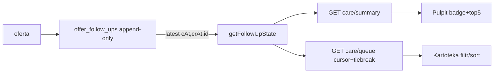

# Opieka: monitoring ofert i przypomnienia — PLAN P0 read-only (CZEKA NA GO, NIE WYKONYWAĆ)

Status: P0 DONE 2026-10-10 (Checkpoint §10). P1/P2 nadal CZEKAJĄ NA GO.
Implementacja P0 ZAKOŃCZONA. GO na plan ≠ GO na kod — P1/P2 bez jawnego GO nadal ZABRONIONE.
P1 (snooze/done/config SLA) i P2 (centrum powiadomień) wymagają osobnego GO po zielonym P0.

Poprzedni moduł follow-up ZREALIZOWANY: `docs/plans/opieka-nad-oferta.md` (checkpoint `5ed0d25`).
Ten plan to warstwa ODCZYTU nad nim, nie drugi CRM.

## 1. Evidence Ledger (FACT z HEAD, nie z pamięci)

| ID    | Twierdzenie                                                 | Dowód                                                                                                                  | Status   |
| ----- | ----------------------------------------------------------- | ---------------------------------------------------------------------------------------------------------------------- | -------- |
| E-001 | `offer_follow_ups` istnieje (outcome, nextContactAt, cycle) | `prisma/schema.prisma:413-436`; migracje `20261008000000`, `20261008000001_fu_terminal_uq`, `20261009000000_fu_cycles` | VERIFIED |
| E-002 | latest = `contactedAt DESC, createdAt DESC, id DESC`        | `src/routes/offers/followUpStats.ts:52`; `src/utils/searchUtils.ts:241`; `src/routes/offers/followUps.ts:133,427`      | VERIFIED |
| E-003 | `contactedAt` NOT NULL (rozjazd SQLite-vs-TS nie istnieje)  | `prisma/schema.prisma:423`; `migration.sql:14 TEXT NOT NULL`; grep `NULLS FIRST/LAST` w `src/` = 0                     | VERIFIED |
| E-004 | scope via `EXISTS` (nie JOIN, nie mnoży wierszy)            | `src/utils/roleFilter.ts:72-78`; scope stats `followUpStats.ts:60-65,110-112`                                          | VERIFIED |
| E-005 | statusy needs_contact / in_progress zdefiniowane            | `src/utils/searchUtils.ts:271-275`; lustro `followUpHealth.ts:14-24`                                                   | VERIFIED |
| E-006 | Idempotency istnieje dla ofert, brak dla follow-up POST     | hity tylko `ruryCrud.ts`, `studnieCrud.ts`, `utils/idempotency.ts`; `followUps.ts` = 0                                 | VERIFIED |
| E-007 | guard terminal/reopen + partial index                       | `followUps.ts:17-22,133-151,200-215`; `uq_fu_terminal_per_cycle`                                                       | VERIFIED |
| E-008 | brak push/mail/cron follow-up                               | `cronService.ts:42-60` tylko ML/FTS/cenniki; grep notif/mailer/push = 0                                                | VERIFIED |
| E-009 | `offers_rel.userId String?` nullable, fail-closed           | `schema.prisma:316,350`; `ownership.ts:9-30`                                                                           | VERIFIED |

## 2. Decyzje po ocenach (co przyjęte)

- P0.1 (8/10): NIE mieszać historii ze stanem. `priority/snoozedUntil/doneAt/care_notifications` → P1/P2. `done ≠ WON/LOST`. P1: stan bieżący w osobnej `care_states`, historia append-only nietknięta.
- P0.2 (8/10): snapshot `ownerId` ODRZUCONY w P0. Źródło prawdy = `offers_*.userId` via `ownership.ts`. Denormalizacja tylko gdy pomiar każe.
- P0.3 (8/10 + 9/10 P0.4): scope `mine/team/all` enforced w SQL PRZED agregacją. `all` tylko admin else 403 (nie silent downgrade). share = read-only. Dedup kluczem `(offerKind,offerId)`, `COUNT(DISTINCT)`, summary i queue ta sama definicja widoczności.
- P0.4 (8/10 + 9/10 P0.1-P0.3): jeden serwis `getFollowUpState`, status ≠ SLA, kontrakt NO_CONTACT poniżej. Nie ruszać `followUpStats/searchUtils/followUps`.
- P0.5 (8/10): Idempotency reuse `claimIdempotencyKey` dopiero w P1. P0 read-only jej nie potrzebuje.
- 9/10 P0.5: paginacja deterministyczna `ORDER BY bucketWeight, COALESCE(next,'9999'), offerKind, offerId`. Cursor (jak search.ts), nie OFFSET. Dowód: `EXPLAIN QUERY PLAN` + test licznika, bez indeksów w P0.

## 3. Kontrakt domenowy P0 (SSoT)

```ts
type FollowUpStatus = 'NO_CONTACT' | 'OPEN_OK' | 'DUE' | 'WON' | 'LOST' | 'ABANDONED';
type SlaBucket = 'OK' | 'DUE_TODAY' | 'OVERDUE_D1' | 'OVERDUE_D3' | 'OVERDUE_D7' | 'OVERDUE_D14';
interface FollowUpState {
    status: FollowUpStatus;
    slaBucket: SlaBucket;
    overdueDays: number;
    slaDueAt: string | null;
}
function getFollowUpState(
    latest: LatestFu | null,
    offerCreatedAt: string,
    nowIso: string
): FollowUpState;
```

- `latest==null` → `NO_CONTACT`, `slaDueAt=offerCreatedAt`, bucket z createdAt (status nigdy nie eskaluje sam).
- `OPEN + next==null` → `DUE / DUE_TODAY / 0`.
- `OPEN + next>now` (inna doba UTC) → `OPEN_OK / OK / 0`; ta sama doba → `OPEN_OK / DUE_TODAY / 0`.
- `OPEN + next<=now` → `DUE` + bucket wg overdueDays: 0=TODAY, 1-2=D1, 3-6=D3, 7-13=D7, ≥14=D14.
- terminal → `WON/LOST/ABANDONED + OK/0`, bez eskalacji.
- latest order: `contactedAt DESC, createdAt DESC, id DESC` (jak E-002). `nowIso` parametr ISO-UTC, `overdueDays=floor((now-due)/86400)`.

## 4. API P0 (bez mutacji)

```
GET /api/care/summary?scope=mine|team|all
→ { ok, counts:{noContact,due,openOk,won,lost}, overdueTop, now }
GET /api/care/queue?scope=&status=&overdueOnly=&from=&to=&cursor=&limit=
→ { ok, items:[{offerKind,offerId,status,slaBucket,overdueDays,nextContactAt,lastContactAt}], nextCursor, totalCount }
```

- Scope w SQL przed agregacją/paginacją. `team` tylko pro/admin, `all` tylko admin.
- DTO, nigdy surowe encje. Daty `toISOString()` UTC.
- Brak POST/PATCH/DELETE w P0. Mutacja kontaktu już istnieje (followUps CRUD), snooze/done → P1.

## 5. Diagram



Koszt: 1-2 SELECT (CTE ROW_NUMBER + GROUP; queue UNION ALL + LIMIT 20-50). Bez `json_extract` jeśli bez wartości. Bez crona, polling FE 60s + pauza `document.hidden`.

## 6. Frontend P0

- `public/js/care/carePanel.js` + `careQueue.js`, ESM, `addEventListener`, zero nowych `window.*`/`onclick` (`collisions:check`).
- Klasy `docs/UI_GUIDELINES.md`, `escapeHtml` treść / `escapeHtmlAttr` atrybuty, `lucide.createIcons({root})` po inject.
- Stany: loading skeleton, empty + CTA do Kartoteki, error toast (nie cisza jak dziś `dashboard.js:118-120`), hidden-tab early return, a11y badge tekst+ikona + `aria-live`.

## 7. Fazy

- **P0 read-only (ten plan):** kontrakt → SQL → GET summary/queue → panel Pulpit + kolejka → regresja → bramy. Zero migracji.
- **P1:** `care_states` + snooze/done + config SLA + audyt w tx + Idempotency-Key na mutacjach. Osobne GO.
- **P2:** centrum powiadomień (polling; SSE/push/mail tylko gdy potrzeba udowodniona). Osobne GO.

## 8. Testy P0 (bez implementacji do GO)

- Kontrakt: null/granice D1/D3/D7/D14/offsety/terminal — rozszerz `tests/sales/followUpSearch.test.ts`, nowy `tests/sales/followUpStatusSla.test.ts`.
- SQL: latest/remis/scope/dedup/paginacja — rozszerz `followUpLatestTie/Wins/SearchRoute`, nowy `followUpQueueSql.test.ts`.
- API: DTO summary/queue, 403 scope=all, 401 — rozszerz `followUpSearchRoute/Stats`, nowy `followUpSummaryQueue.test.ts` (supertest, bez POST).
- FE: loading/empty/error/hidden/a11y — rozszerz `followUpWidget/Badge`, nowy `followUpQueue.test.ts`.
- Regresja: CRUD + stats nietknięte, IDOR (`clientsIdor`), XSS (`xssSinks`), EXPLAIN (`dbQueryCounter`), timezone.

## 9. Bramy (kolejność, STOP przy pierwszym RED)

```powershell
npm run typecheck
npm run typecheck:frontend
npm run lint
npm run lint:frontend
npm run collisions:check
npm run test:quick
npm run prices:verify
npm run version:check
npm run validate
npm run format
node scripts/commit.mjs "typ(scope): opis"
```

Granice twarde: zero migracji/schematu/POST/PATCH/CRUD/powiadomień. Przekroczenie = STOP + nowe GO.

## 10. Checkpoint (GO 2026-10-10, tryb build)

- P0.1 DONE: `src/utils/careStatus.ts` + `tests/sales/followUpStatusSla.test.ts` (16/16 PASS).
- P0.2 DONE: `src/services/careService.ts` (latest CTE, scope mine/team/all + shares EXISTS, dedup, cursor, max 2 SELECT, summary GROUP BY) + `tests/offers/followUpQueueSql.test.ts` (7/7 z share).
- P0.3 DONE: `src/routes/care.ts` (GET /summary + /queue, Zod, DTO ze statusem, 403 scope, 401) + mount `src/mountRoutes.ts` + `tests/offers/followUpSummaryQueue.test.ts` (4/4).
- P0.4 DONE (minimal): `public/js/care/carePanel.js` (ESM, polling 60s + hidden-tab, error alert, zero nowych globals; collisions baseline 45).
- Bramy: typecheck BE/FE PASS, lint BE/FE PASS, collisions 45/45, new tests 27/27 PASS, `test:quick` 4440 PASS + 1 flaky `pricelistChunk` (solo PASS, znany flake workerów, brak związku z care), `prices:verify` PASS, `version:check` 1.41.2 PASS.
- Granice dotrzymane: zero migracji, zero POST/PATCH, `followUps/stats/searchUtils` diff=0.
- Status: **P0 GOTOWE DO COMMIT** (bez pusha — push osobne GO). **P1/P2 nadal CZEKAJĄ NA GO**.

## 11. Checkpoint P1 (GO 2026-10-10, tryb build, commit `7d4a669`)

- Schema: `care_states` (PK kind+id, snooze/done rozłączne) + `care_sla_config` (1 wiersz global).
  Migracja `20261010000000_care_p1_states_sla` additive IF NOT EXISTS (drift-safe, rerun-safe);
  `migrate dev` żądał resetu (drift FTS) → zastosowana ręcznie na live DB + backup + wiersz
  w `_prisma_migrations`. `generate` wymaga restartu serwera (DLL trzymane) — kod P1 idzie
  przez `$queryRaw`, działa bez restartu.
- Service: `get/set/clearCareState`, `get/setSlaConfig` (default 24/7/72), queue LEFT JOIN
  `care_states` (pola `snoozedUntil/doneAt/paused`, bez N+1).
- API: `POST /:kind/:id/snooze` (ISO strict, przyszłość, max 14d) + `/done` + `/reopen`
  (guard `canWriteDoc`, 404, Idempotency-Key reuse/in-progress, audyt `care_state` w tx);
  `GET/PUT /sla` (PUT tylko admin, audyt `care_sla`).
- Testy: state 2/2, routes 5/5, queue+summary+status 27/27, migracja 1/1.
- Bramy: typecheck/lint BE+FE PASS, collisions 45/45, prices:verify PASS, version:check 1.41.2.
- Uwaga: restart serwera po dogodnym momencie (świeży klient Prisma + nowy kod tras).
  **P2 (centrum powiadomień) nadal CZEKA NA GO**.
